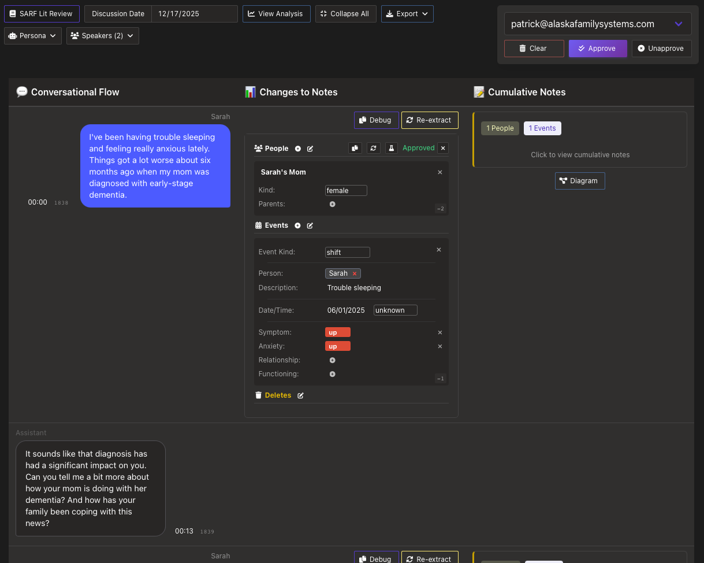
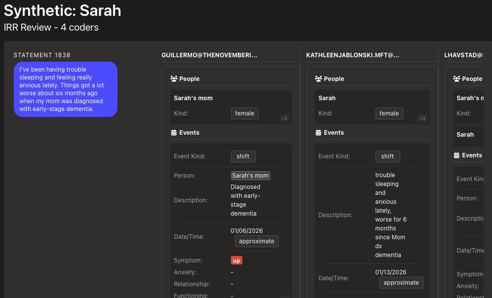
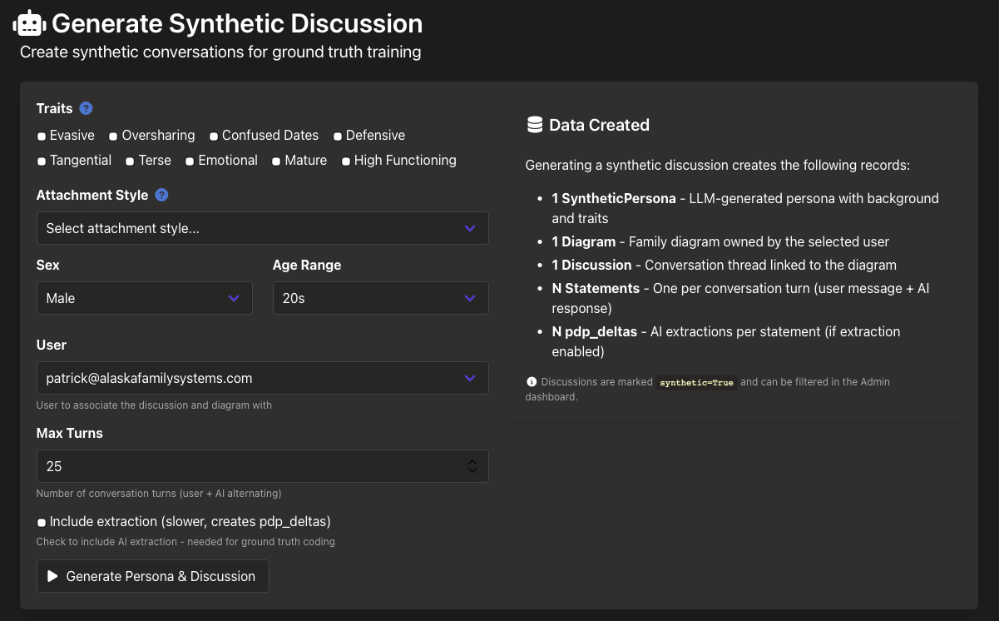
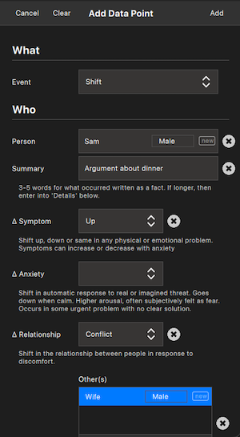

# Clinical Research at the Cutting Edge

**Audience:** Family therapists, trainees, graduate students (non-technical, Bowen tradition context, international/translated)
**Duration:** 45 minutes (11:15-12:00)
**Format:** Conversational, low resolution, room for questions throughout
**Follows:** Presentation 2 (SARF Intro) which gave the framework; Presentation 1 (Why Family) which covered the catastrophes

---

## STRUCTURE

| Section | Time | Running |
|---------|------|---------|
| I. Connecting to this morning | 5 min | 5 |
| II. The scaling problem | 10 min | 15 |
| III. Domain-expert ground truth | 10 min | 25 |
| IV. Discoveries | 10 min | 35 |
| V. What becomes possible | 5 min | 40 |
| VI. Honest state + close | 5 min | 45 |

---

## I. Connecting to This Morning (5 min)

**Without measurement, we can't tell when we're making it worse.**

This morning we saw:
- Practices that harmed the people they intended to help
- Professions swept up in beliefs that destroyed lives
- No one asked: *"What if this is making things worse?"*

**Cambridge-Somerville:** Caring intervention. Treatment group had more crime, more addiction, earlier death.

*"How would we know?"*

This presentation is the answer to that question.

---

## II. The Scaling Problem (10 min)

### Big data vs. small data

| Big Data | Small Data |
|----------|------------|
| Millions of records | Rich qualitative information |
| Simple variables | Requires interpretation |
| Machine-readable | Requires intelligent inference |
| Insurance claims, lab results | Clinical interviews, family history |

Our problem is small data.

### The coding problem

To test SARF, someone has to code cases:
- Read/listen to clinical interviews
- Identify shifts in S, A, R, F
- Record them on a timeline

Previously: humans doing this tediously, by hand.

### Why this research never happened

- Hypothetical model with simple but deep concepts
- Requires skilled human coders
- Coding doesn't scale
- Can't get funding or momentum unless it's someone's day job

The bottleneck was human coding capacity.

### What changed

Machine automation now makes intelligent inference possible at scale.
- Generate synthetic clinical discussions for training
- Test automated coding against human judgment
- Iterate faster than ever before

*We built this.*

---

## III. Domain-Expert Ground Truth (10 min)

### Ground truth = what the domain experts agreed on

1. Train human experts on SARF
2. Have them code cases independently (blind)
3. Measure agreement (Inter-Rater Reliability)
4. Cases where they agree = ground truth

*The humans set the standard.*

### Why ground truth matters

The machines don't decide what's correct. Humans do.
- Software learns to replicate human expert judgment
- Every output can be reviewed and corrected
- Domain experts remain the authority

*Ground truth is human truth.*

### The infrastructure

We built a web-based system:
- Case management
- Blind coding workflow
- Agreement statistics

### The killer combo: IRR + AI

**All AI needs is IRR.**

| What AI Requires | What IRR Provides |
|------------------|-------------------|
| Labeled examples | Human-coded cases |
| Consistent labels | Agreement-verified coding |
| Scale | Growing database |

A dataset with sufficient agreement **is** ground truth.

*IRR + AI = the breakthrough.*

---

## IV. Discoveries (10 min)

### Modeling clinical discussion

To train humans and test software, we needed data.

**Solution:** Generate synthetic clinical discussions — realistic scenarios, SARF-codeable content, controlled environment for training.

### Discovery: Mutual discovery

**You can't survey for this data like a knee problem.**

The therapist must be in a process of *mutual discovery* with the client, or you can't get the data you need.
- Not extracting answers
- Exploring together
- The relationship affects what emerges

*If you just interrogate, you don't get the data you need.*

### Discovery: Synthetic data trains faster

The working group learned SARF coding faster on synthetic data than real cases.
- Cleaner examples
- Known ground truth
- Faster iteration

*Real recordings are the goal. Synthetic data accelerates getting there.*

### Discovery: Timelines cluster by emotional salience

Timeline data naturally clusters into ~3-5 notable periods.
- The client has a "sampling bias" — they report what's emotionally salient to *them*
- They don't give you an even history; they give you the periods that matter
- These clusters typically follow a nodal/triggering event
- The clustering itself *is* the emotional process — you don't have to know what to look for

*The client's own selection bias is the data.*

### The responsibility pattern

Two 45-minute interviews. Person sees for the first time:
- Pattern of constantly picking up responsibility
- Saying yes to everything, no filter
- Anxiety going up and up
- **No downs.**

*Just seeing the data organized was the breakthrough.*

---

## V. What Becomes Possible (5 min)

### Two eras

**Era 1: AI Learns from Humans**
- IRR establishes ground truth
- AI replicates what humans agreed on
- Scales human judgment

**Era 2: AI Discovers New Patterns**
- Ground truth database accumulates
- AI finds correlations humans couldn't see
- New hypotheses for humans to test

*We're building Era 1. Era 2 follows.*

### If this works

- **Certification:** Objective competency testing — compare trainee coding to ground truth
- **Standardized training:** Measurable outcomes, curriculum based on validated method
- **Aggregate research:** Data across practitioners, statistical patterns emerge
- **Tooling:** Vertically integrated pro/personal app ecosystem, novel clinical model

### Why it scales (vertical alignment)

One simple coding form gives you everything.

| You code... | You get... |
|-------------|------------|
| Structured SARF entries | Direct comparison to AI extraction |
| Stream of changes | Real-time coding while interviewing |
| Defined fields | Stats without transformation |
| Same format | Replicable studies |
| Curated cases | Growing ground truth database |

*Design the data model right, and everything else falls into place.*

### Getting involved

*More on this at day's end.*

This needs people: clinicians testing the model, researchers contributing cases, developers building tools.

---

## VI. Honest State + Close (5 min)

### Where we are

Early stage. Showing the process.
- First IRR meeting: next week
- Synthetic data: working
- Real recordings: exploring

*This is what real R&D looks like.*

### The human remains central

- Ground truth is set by domain experts
- Software replicates human judgment
- Every output reviewable and correctable

*Technology scales. Humans validate.*

### Tools

| Tool | Status |
|------|--------|
| **Pro App** | Released — timeline + diagram |
| **Personal App** | In development — structured intake |
| **IRR System** | In use — research infrastructure |

alaskafamilysystems.com

---

## Key Lines

- "Without measurement, we can't tell when we're making it worse."
- "How would we know?"
- "All AI needs is IRR."
- "IRR + AI = the breakthrough."
- "We're building Era 1. Era 2 follows."
- "Ground truth is human truth"
- "The machines don't decide what's correct. Humans do."
- "Technology scales. Humans validate."
- "If you just interrogate, you don't get the data you need."
- "Just seeing the data organized was the breakthrough."
- "Design the data model right, and everything else falls into place."

## Risks

- **Redundancy with Pres 5 "What Becomes Possible":** Overlaps. Mitigation: this version is institutional outcomes; Pres 5 centers on the experience of thinking differently.
- **Too technical:** IRR, synthetic data, AI eras could lose the audience. Mitigation: low resolution, analogies, room for questions.
- **Pitch-y on tools:** Keep tools secondary to the research story.

## Connection to Day's Arc

- **Pres 1 (Why Family):** The field is broken, no measurement → catastrophes
- **Pres 2 (SARF Intro):** Here's a minimal framework
- **Pres 3 (This one):** Here's how to actually research it
- **Pres 5 (Close):** What it all adds up to, call to action
