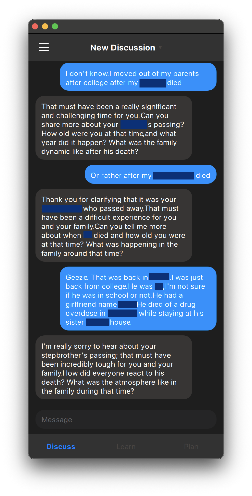
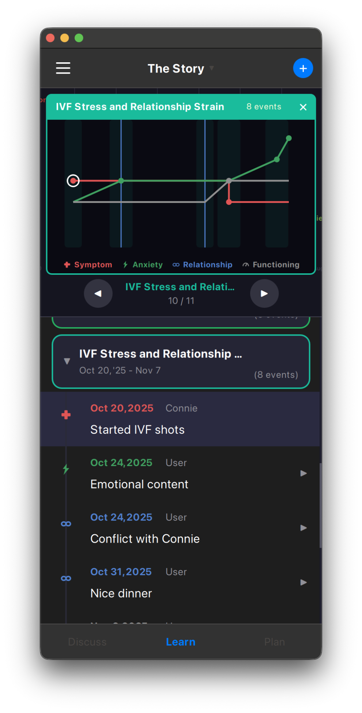
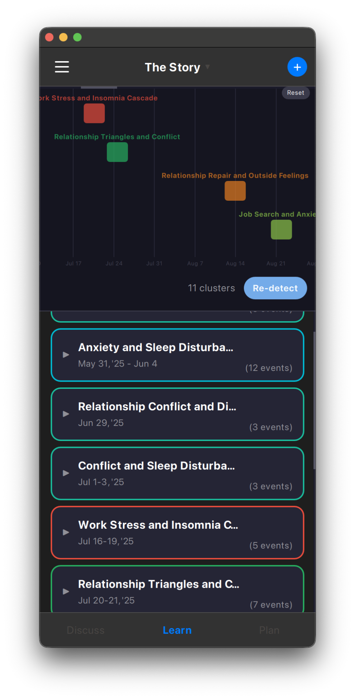

# PGP 2026 Lecture: Hypothesis Testing in BT, SARF Clinical Model, R&D

**Date:** Monday, February 9, 2026
**Format:** Zoom
**Duration:** 2 hours 45 minutes

---

## Table of Contents

| Part | Topic | Time | Elapsed | Subsections |
|------|-------|------|---------|-------------|
| **1** | [The Problem](#part-1-the-problem-25-min) | 25 min | 0:25 | Behavioral health, historical catastrophes, fatal flaw, data requirements |
| **2** | [SARF — The Minimal Data Model](#part-2-sarf--the-minimal-data-model-35-min) | 35 min | 1:00 | What's needed, pipeline, vignette, atomic operation, vertical alignment, what you get for free, early findings |
| **—** | [Mid-Presentation Discussion](#mid-presentation-discussion-20-min) | 20 min | 1:20 | |
| **3** | [What We're Building](#part-3-what-were-building-30-min) | 30 min | 1:50 | Tool ecosystem, Pro demo, Personal screenshots, Training App, IRR working group, IRR+AI pipeline |
| **4** | [Implications](#part-4-implications-15-min) | 15 min | 2:05 | Certification, training, aggregate research |
| **5** | [The Challenge](#part-5-the-challenge-15-min) | 15 min | 2:20 | 3-minute challenge, why it matters, app seminar |
| **6** | [Closing Discussion](#part-6-closing-discussion-25-min) | 25 min | 2:45 | |
| — | [Reference Articles](#reference-articles) | | | SARF framework, Stinson articles, historical case studies, novel contributions |
| — | [Get Involved](#get-involved) | | | For clinicians, for researchers |

---

## PART 1: THE PROBLEM (~25 min)

**Purpose:**
- Make the case that everyone—especially those of us in helping professions—must think as scientifically as we can. The stakes are too high not to.
- Draw the line between professional STEM research and "research" on your own family.

### 1.1 The State of Behavioral Health

**Treatment-prevalence paradox (Ormel 2022):**
- Treatment up **fourfold** since 1990s
- Prevalence of mental disorders: **no decrease**
- More therapists, medications, awareness → no population-level improvement

**Relapse rates worsen (MDD):**
- 1st episode: ~50% relapse
- 2nd: ~70%
- 3rd: ~90%
- We're managing something we don't understand

**Youth crisis:**
- 145% increase in teen depression (2010-2019)
- Teen girls: 57% persistent sadness/hopelessness (CDC 2023)
- More therapists, more funding, more awareness → **problems got worse**
- *(Haidt's social media research is compelling, but doesn't change the main point)*

**Replication crisis:**
- Only ~40% of psychology studies replicate
- 2013: NIH stopped funding DSM-only research
- DSM has no theoretical framework—just symptom checklists

**The question:** We're doing more than ever. Why isn't it working?

**Implicit model in the Field:**
- Field assumes the problem is inside the individual
- This determines treatment, research design, funding—everything
- *Proposition: We're studying the blade of grass and ignoring the wind*

### 1.2 Historical Catastrophes

Caring professionals—people like us—who caused massive harm because they weren't thinking scientifically.

**Cambridge-Somerville Youth Study (1939-1945):**
- Intervention:
  - At-risk boys randomized to treatment vs. control
  - Treatment: counselors (avg 5 years), tutoring, summer camps, medical/psychiatric care, YMCA, Boy Scouts, family counseling
  - Intention: prevent delinquency through caring relationships
- 30-year follow-up (Joan McCord):
  - Treatment group **worse on every measure**
  - More crime, alcoholism, mental illness, stress diseases
  - Died younger
- Key line: "The counselors loved these boys. The boys said the program changed their lives. And it killed them faster."
- Without measurement, we'd never know. We'd keep doing it.

**Recovered Memory Therapy (1980s-1990s):**
- What it was:
  - Belief: childhood sexual abuse = hidden cause of adult problems
  - Method: hypnosis, guided imagery, suggestion to "recover" memories
- What happened:
  - Patients "remembered" abuse that never occurred
  - Accused parents, relatives, neighbors
  - Families destroyed; some accused imprisoned
- Scale:
  - ~1 million patients treated
  - Tens of thousands of families torn apart
  - FBI: zero corroborating physical evidence in any satanic abuse case
- End: malpractice suits mounted → epidemic disappeared
- These were licensed professionals following accepted practices

**The pattern:**
- Anxiety high → people seek certainty
- Untestable + simple ideology provides relief
- Believers calm down, feel they understand
- No self-correction → real problem stays hidden
- Worst case: "treatment" does more damage than original problem
- *Takeaway: Not bad people—caring professionals without a way to test*

### 1.3 The Fatal Flaw in Bowen Theory

**Bowen Theory has the same structural problem.**

No evidence of a single explicit predictive model:

- **Explicit** = outside the brain; material form anyone can inspect
- **Predictive** = forecasts what will happen, not just explains past
- **Model** = simulation that produces testable predictions

**State of the art:** Model is in the coach's head. Brain is the material the calculation runs on. "Theory predicts X" = mental prediction, not testable by others.

**Markers of pseudoscience** (Popper, Lilienfeld):

| Marker | How It Shows Up |
|--------|-----------------|
| No falsifiable predictions | "Another triangle" or "one more generation" |
| No self-correction | Claims stay inside in-group |
| Circular definitions | "Differentiation" ↔ "solid self" |
| Obscurantist language | Jargon only in-group understands |
| No boundary conditions | Triangles everywhere—what do they NOT predict? |
| Reference to seminal thinker | Cite Bowen, not testable models |

**Additional proposed markers (Stinson):**

| Marker | How It Shows Up |
|--------|-----------------|
| No new explicit predictive models | No technical talent pursuing BT model development; no variations or improvements on core predictions |
| Attention shifting to application | Focus on coaching/therapy technique, not advancing the formal state of the art |
| Theory before model | 8 concepts already formulated; now trying to find models to fit them (inverts inductive process) |
| No replicability | Can't specify how another researcher would collect data to replicate a finding |
| Meditation-like practice to learn | Takes 3+ years of training to understand the concepts; not easily demonstrable or communicable |
| Reference to seminal thinker vs. models | Cite Bowen's writings and biography, not formally testable predictions |
| Circular definitions | "Differentiation" ↔ "solid self" ↔ "basic self" |
| Conflating construct with value | Differentiation treated as always good; higher = better (violates Hume's is-ought) |

*(Reference material for audience review — too abstract for presentation time)*

**These markers don't mean observations are wrong. They mean we haven't proven they're right.**

If we can't test it—how do we know we're not the next Cambridge-Somerville?

**The lung cancer test:**
- Some 16-year-old creates model: 80% accuracy vs. 40%
- Everyone gets it instantly—no mythology required
- Focus shifts to technology and problem
- If Bowen had explicit predictive models that work, we'd talk about the models, not the mythology

### 1.4 Data Requirements

All rigorous research requires **data**.

Not impressions. Not narratives. Not "I've seen this pattern." **Data that a critic can agree with.**

Requirements:
- **Systematically collected** — same method every time
- **Cleanly recorded** — defined fields, not free-form notes
- **Sufficient sample size** — N > 1
- **Comparable across cases** — same format, aggregatable
- **Available for critique** — others can inspect, challenge, reanalyze

Without this: stories, not research.

**The question for Bowen Theory:** What would we even collect? What's the data model?

NOTE: DoS is applying scientific **principles** to your own family history & emotional functioning, which is **not the same as formal scientific research.**

---

## PART 2: SARF — THE MINIMAL DATA MODEL (~35 min)

**Purpose:** SARF is an answer. A minimal, systematic way to collect data on emotional process.

### 2.1 What's Needed

Before you can have a predictive model, you need a **data model**—a formal definition of what gets tracked.

A data model answers:
- What exactly do you record to capture what theory describes?
- What applies across every case—not just this family, but any family?
- How do you track triangles in a way that's not just mental, but recorded?
- And more

### 2.2 The SARF Pipeline

**What SARF Is:**
- *The clinical hypothesis in Bowen theory*
- Qualitative, timeseries data model for clinical evaluation and research
- Simplifies relationship complexity into a minimum testable method
- Not comprehensive out of the gate—intended to grow in precision as evidence permits
- Parallel to NIH's RDoC: minimal framework to organize testable hypotheses, focused on validity

**The Pipeline: R → A → S**

- **(R)elationship** shifts modulate **(A)nxiety**
- **(A)nxiety** modulates **(S)ymptoms**
- **(F)unctioning** is the independent clinical variable—where clinical work happens

**(S) Symptom**
- What brings people in to see clinicians
- Encompasses: mental, behavioral, emotional, psychiatric diagnoses
- Also includes medical symptoms—especially chronic, complex, hard-to-predict: auto-immune, allergies, cancers
- Value space: up, down, same

**(A) Anxiety**
- Synonymous with autonomic threat response
- Determined by *perceived* threat (not objective threat)
- Deeply biological, evolutionarily very old
- This is why it impacts both behavioral/emotional symptoms AND physiological symptoms
- Value space: up, down, same

**(R) Relationship**
- Automatic moves a person makes in relation to one or more others
- "Automatic" = driven by emotion, without choice, short-term motivation vs. long-term thoughtfulness
- Value space: conflict, distance, reciprocal functioning, child-focus, cutoff, inside (triangle), outside (triangle), define-self

**(F) Functioning**
- How much others influence the person's thinking and feeling.
- How well balanced emotion and thinking is toward the person's goals
- Goals defined when they are at their calmest
- When low: ruled by emotion, unable to use intellect to plan, problem solve, see forest for trees
- Clinical change = "function up" → decreases impact of R on A, and so also S
- Value space: up, down, same

**Clinical Application:**
- Collect timeline of shifts in each variable during assessment interview
- Evaluate for correlations between R, A, and S over time
- Use the [SARF Exhaustive Lit Review](https://github.com/patrickkidd/btcopilot/tree/master/doc/sarf-definitions) for operational definitions
- SARF is used like differential diagnosis: rule out A and R as impacting S before assuming symptom is purely individual
- The hypothesis is re-tested in each clinical case (evidence-based practice)

**Key Point:** SARF does not claim *all* symptoms work this way—that would be bad science. It provides a testable framework to *check*.

### 2.3 A Clinical Vignette: Coding in SARF

Here's what SARF coding looks like in practice.

**The case:** A mother brings in her 11-year-old daughter for nail-biting.

"She bites her nails. It's always been there."

I asked one question: **"When did it start?"**

The mother paused. "Well... it was when her boyfriend left."

Two sessions later, the symptom was gone. The mother forgot it had ever existed.

**The SARF coding:**

| Variable | Value | What I Found |
|----------|-------|--------------|
| **S** | up | Nail-biting in daughter |
| **R** | distance | Boyfriend fled → Mother's relationship system destabilized |
| **A** | up | Mother's anxiety spiked |
| **S** | up | Daughter's nail-biting started at the same time |

The symptom wasn't "in" the daughter. It was a downstream effect of the mother's relationship shift.

**The R → A → S pipeline in action:** Relationship shift (boyfriend leaves) modulates anxiety (mother's anxiety spikes), which modulates symptom (daughter starts biting nails).

This is what we're learning to code. This is the data.

### 2.4 The Atomic Operation

The smallest indivisible action in emotional process: A **SARF shift**.

- Chronological / date based
- One mover, one or more recipients
- One or more SARF shifts
- R always has 1-N recipients
  - Triangles are unique - has a third point
- Can even be 1ms apart, just track. them

"Emotional process" emerges from the chain of atomic operations

### 2.5 Vertical Alignment

**One coding form gives you everything:**

| You code... | You get... |
|-------------|------------|
| Structured SARF entries | Direct comparison to AI extraction |
| Stream of changes | Real-time coding while interviewing |
| Defined fields | Stats without transformation |
| Same format | Replicable studies |

**Delta-based data model:**
- "Stream of changes" is key
- SARF captures *deltas*—changes over time—not static snapshots
- Each entry is a shift: anxiety went up, relationship moved toward conflict, symptom appeared
- Delta-based approach matches how emotional process actually unfolds

Design the data model right, and everything else falls into place.

### 2.6 What You Get for Free

**Core point:** Focus on clean, correct, data-driven scientific practice → you get something you can actually call "Bowen theory"

**The problem:**
- Bowen is in every family therapy textbook
- Almost always misrepresented
- Textbooks don't understand Bowen was focused on natural science and predictive theory—not therapy
- Most of field still doesn't know the difference between theory and therapy
- They think therapy *is* theory

**The current barrier:**
- Takes practically unlimited reading and 3-year training program to understand how BT is actually different
- You have to absorb so much to see the distinction

**Hypothesis: SARF solves this:**
- At conceptual level, it's **obviously** different:
  - Different from individual therapy (unit of analysis = relationship system, not individual)
  - Different from any other psychological data model (tracking R → A → S across timeline of family functioning)
- Don't need 3 years of training to see this is something else
- Data model makes the distinctiveness self-evident

**Focus on the science, and you SHOULD end up with Bowen theory—recognizably, demonstrably.**

### 2.7 Early Findings from the R&D

Systematic data collection has revealed things we couldn't see before:

**Mutual discovery:**
- Can't survey for this data like a knee problem
- Therapist must be in *mutual discovery* with client—exploring together, not extracting answers
- The relationship affects what emerges
- If you just interrogate, you don't get the data you need

**Synthetic data trains faster:**
- Working group learned SARF coding faster on synthetic (AI-generated) clinical discussions than real recordings
- Cleaner examples, known ground truth, faster iteration
- Real recordings remain the goal—synthetic data accelerates getting there

**The responsibility pattern:**
- Two 45-minute interviews with one person
- They see for the first time—laid out on timeline—a pattern of constantly picking up responsibility
- Saying yes to everything, no filter
- Anxiety going up and up. **No downs.**
- Just seeing data organized was the breakthrough—no sophisticated analysis required

**Clusters:**
- Timeline data naturally clusters into **3-5 notable periods**
- Why? Client's internal/emotional "sampling bias" determines which periods they report
- They tell you about times emotionally salient to *them*
- These clusters ARE the "emotional process" described in Bowen theory
- Typically follow a nodal/triggering event
- Reveal acute/episodic fluctuations in SARF variables over baseline
- Baseline = state in relatively quiet periods between clusters
- **The clustering itself is the signal—you don't have to know what to look for**

---

## MID-PRESENTATION DISCUSSION (~20 min)

**Purpose:** Let questions and reactions surface before going into tools and technology.

### Discussion Prompts

1. **The historical catastrophes:** What's your reaction? Could you see yourself caught up in something like that?

2. **The pseudoscience markers:** Which ones hit closest to home?

3. **The SARF model:** Does this capture what you observe clinically? What's missing?

4. **The nail-biting vignette:** How would you have coded it? What would you add?

---

## PART 3: Tech Ecosystem (~30 min)

**Purpose:** Show the tools and demonstrate rigor.

### 3.1 The Tool Ecosystem

| Tool | Status | Function |
|------|--------|----------|
| **Family Diagram Pro** | Released | Timeline + diagram for clinicians |
| **Family Diagram Personal** | In development | AI intake, generates timeline/diagram via conversation |
| **Training App** | In use | Research infrastructure, blind coding workflow |

### 3.2 "The App" — Family Diagram Pro

Show:
- Add form
- "Facts alone" (dated functional facts)
- Dynamic visualization
- SARF shifts on diagram
- Forces you to understand the data

**Key point:** This is the technology that makes it possible to present a clean argument in under 3 minutes. The data entry is designed so that cleaning it up and presenting it to a good-faith critic becomes feasible.

### 3.3 Family Diagram Personal (In Development)

AI-assisted intake that generates timeline and diagram through conversation. The user talks with an AI interviewer; the app extracts SARF variables and builds the case automatically.

  
  
  

*Left: Conversational AI intake. Center: Focused cluster with SARF variable graph. Right: Auto-detected timeline clusters (3-5 notable periods).*

### 3.4 The Training App

This is an open-source R&D project taking AI-assisted Bowen theory application to a professional level.

**The core idea:**
- LLMs can read and understand the Bowen literature (which is remarkably internally consistent)
- Chain multiple AI calls together as "building blocks"—each analyzing a different piece of the problem
- Combine the results into a coherent evaluation

**Building blocks example:**
- One call: Where are the key triangles?
- Another: What's the baseline anxiety vs. fluctuations?
- Another: What's the hypothetical baseline configuration?
- Final call: Synthesize into an overall formulation

Show:
- Mobile app interface with timeline data
- The clustering visualization (3-5 notable periods visible)
- Example of AI-generated case formulation

*Let the screenshots speak for themselves.*

### 3.5 The IRR Working Group: What Humans Are Doing

This is where the "*ground truth*" gets established. People trained in Bowen theory are doing the work that makes everything else possible.

**What IRR means:** Inter-Rater Reliability. Can two trained coders, working independently, code the same case the same way?

**The workflow:**

1. **Training materials** — Coders learn the SARF data model and coding rules
2. **Blind coding** — Each coder codes a case independently, without seeing others' work
3. **Comparison** — Codings are compared to measure agreement
4. **Reconciliation** — Where coders disagree, they discuss and resolve
5. **Ground truth emerges** — Agreed-upon codings become the standard

**What coders are actually doing:**
- Listening to case recordings or reading transcripts
- Identifying SARF variables: What's the symptom? What relationship shifts preceded it? What happened to anxiety?
- Coding toward/away moves and triangles
- Timestamping events on a timeline
- Producing structured data that can be aggregated across cases

**Why this matters:** Without human agreement, there's no ground truth. Without ground truth, AI has nothing to learn from. The IRR working group IS the foundation—everything else depends on what they produce.

**Current status:** Working group active. Synthetic data has accelerated training. Real case recordings in exploration.

### 3.6 The IRR + AI Pipeline

**Ground truth = what domain experts agreed on.**

| What AI Requires | What IRR Provides |
|------------------|-------------------|
| Labeled examples | Human-coded cases |
| Consistent labels | Agreement-verified coding |
| Scale | Growing database |

**The connection:** IRR produces the data that AI learns from. AI then helps scale what humans can do. But humans remain the source of ground truth.

**Two Eras:**
- **Era 1:** AI learns from humans (we're building this)
- **Era 2:** AI discovers patterns humans couldn't see

---

## PART 4: IMPLICATIONS (~15 min)

**Purpose:** Show what becomes possible.

### 4.1 If This Works

**Certification**
- Objective competency testing
- Compare trainee coding to ground truth

**Standardized Training**
- Measurable outcomes
- Curriculum based on validated method

**Aggregate Research**
- Data across practitioners
- Statistical patterns emerge

### 4.2 Status

**Where we are:**
- IRR working group active
- Synthetic data working
- Real recordings in exploration

This is what real R&D looks like. Early stage. Showing the process.

---

## PART 5: THE CHALLENGE (~15 min)

**Purpose:** Make it concrete. The climax.

### 5.1 The 3-Minute Challenge

You know you understand a family case when you can:

1. **Make a case presentation under 3 minutes** (ideally 2 minutes)
2. **Include only the minimum necessary data** for a clean argument
3. **Present to a good-faith critic** (someone who doesn't share the bias—like a physicist)
4. **Use a generalized formula, not ad hoc** (applies word-for-word to another family)
5. **Repeat with 3 more cases** (prove it replicates)

Make your case generic and send me a vidio.

### 5.2 Why This Matters

This is the difference between:
- A belief system that only makes sense to the in-group
- A scientific claim that anyone can test

If we can't make a clean 3-minute case to someone outside the network, we haven't proven anything.

### 5.3 The App Seminar

**The Family Diagram App Seminar** is for working professionals who want to up their game.

What it is:
- Monthly Zoom sessions
- Exploring cases and methodology
- Building the skills to make clean arguments
- Contributing to the research effort

**Who it's for:**
- Clinicians who want to apply rigorous thinking to their cases
- People who want to contribute to the formal research effort
- PGP gives you the conceptual model, app seminar is one place to operationalize it.

**alaskafamilysystems.com**

---

## PART 6: CLOSING DISCUSSION (~25 min)

**Purpose:** Let the group go deeper.

### Discussion Threads

1. **The implicit model in your own practice:** Where do your predictions come from? Could you write them down?

2. **The 3-minute challenge:** Who wants to try it? What would you need?

3. **The differentiation question:** Is the modeling effort compatible with differentiation of self?

4. **The IRR contribution:** Who's interested in becoming a coder?

5. **Getting involved:** What's the next step for someone who wants to contribute?

---

## PRESENTER NOTES

### Timing Guide

| Part | Duration | Cumulative |
|------|----------|------------|
| 1. The Problem | 25 min | 0:25 |
| 2. SARF | 35 min | 1:00 |
| Mid-Discussion | 20 min | 1:20 |
| 3. The Tech Ecosystem | 30 min | 1:50 |
| 4. Implications | 15 min | 2:05 |
| 5. The Challenge + App Seminar | 15 min | 2:20 |
| 6. Closing Discussion | 25 min | 2:45 |

**Total: 2h 45min**

### Demo/Screenshot Checklist

- [ ] Family Diagram Pro open and ready for live demo
- [ ] Sample case loaded with timeline
- [ ] Screen share tested on Zoom
- [ ] btcopilot R&D screenshots prepared:
  - [ ] Mobile app interface with timeline
  - [ ] Clustering visualization (3-5 periods visible)
  - [ ] Example AI-generated case formulation

### Key Lines

- "We're doing more than ever. Why isn't it working?"
- "We're studying the blade of grass and ignoring the wind."
- "More therapists than ever. More funding than ever. More awareness than ever. Problems got worse."
- "The counselors loved these boys. The boys reported the program positively changed their lives. And it killed them faster."
- "These were licensed professionals with good intentions following the accepted practices of their field."
- "This is not about bad people. It's about what happens when caring professionals don't think scientifically."
- "The model is in the coach's head—the brain is literally the material the calculation runs on."
- "If we can't test it, how do we know we're not the next Cambridge-Somerville?"
- "If Bowen Theory had explicit predictive models that work, we'd talk about the models, not the mythology."
- "Without human agreement, there's no ground truth. Without ground truth, AI has nothing to learn from."
- "Make a 3-minute case to a good-faith critic. Prove it."
- "The PGP gives you the conceptual model. The app seminar is where you operationalize it."

### Audience Notes

- PGP trainees: sophisticated, already trained in Bowen theory
- Don't soften the pseudoscience thesis—it went over well at the Symposium
- These people often become the most interested in the app seminar
- They've felt the frustration of trying to communicate outside the network
- Potential IRR contributors—make the invitation clear

## Reference Articles

### SARF Framework

| Document | Description |
|----------|-------------|
| [SARF White Paper](resources/SARF-White-Paper.md) | Definition, variables, and R&D roadmap |
| [Anxiety as a Core Concept](resources/Anxiety-as-a-Core-Concept-in-Human-and-Animal-Behavior.md) | Deep dive on the "A" variable — evolutionary basis and cross-species objectivity |

### Dr. Stinson's Literary Research

| Article | Topic |
|---------|-------|
| [Emotional Systems Research Methodology](articles/Stinson-Emotional-Systems-Research-Methodology.md) | Two-phase research methodology |
| [The Role of Modeling in Scientific Theory](articles/Stinson-The-Role-of-Modeling-in-Scientific-Theory.md) | Why explicit models matter |
| [The Implicit Model](articles/Stinson-The-Implicit-Model.md) | What we actually do vs. what we say we do |
| [The Importance of the Timeline](articles/Stinson-The-Importance-of-the-Timeline-in-Family-Diagram.md) | Timeline construction methodology |
| [Induction and Family Diagram](articles/Stinson-Induction-and-Family-Diagram.md) | Induction vs. deduction in Bowen theory |
| [Daily Logging with Toward and Away](articles/Stinson-Daily-Logging-in-Family-Diagram-With-Toward-and-Away.md) | Toward/away as atomic operations; daily logging |
| [Barriers to Science for Bowen Theory](articles/Stinson-Barriers-to-Science-for-Bowen-Theory.md) | Markers of pseudoscience; need for explicit predictive models |
| [The AI Revolution and Family Assessment](articles/Stinson-AI-Revolution-and-Family-Assessment.md) | LLMs, BT Co-pilot, building blocks for automating evaluation |

### Historical Case Studies

| Case | What Happened |
|------|---------------|
| [Cambridge-Somerville Youth Study](articles/Cambridge-Somerville-Youth-Study.md) | Caring intervention made outcomes worse |
| [Lobotomy Epidemic](articles/Lobotomy-Epidemic.md) | 50,000+ surgeries; Nobel Prize; devastation |
| [Recovered Memory Therapy](articles/Recovered-Memory-Therapy.md) | ~1 million patients; families destroyed |
| [Refrigerator Mother Theory](articles/Refrigerator-Mother-Theory.md) | 20 years blaming mothers for autism |
| [Salem Witch Trials](articles/Salem-Witch-Trials.md) | 1692; spectral evidence; 25+ deaths; jurors later apologized |
| [Satanic Panic & Daycare Abuse](articles/Satanic-Panic-Daycare-Abuse.md) | 12,000+ cases; McMartin trial ($15M, 0 convictions) |
| [MPD/DID Epidemic](articles/MPD-DID-Epidemic.md) | 50,000 diagnoses vs. ~200 prior; epidemic disappeared when practices stopped |

### Novel Contributions to the Field

Original research and infrastructure from the [BT Copilot R&D project](https://github.com/patrickkidd/btcopilot):

| Contribution | Description |
|--------------|-------------|
| [SARF Literature Review](https://github.com/patrickkidd/btcopilot/tree/master/doc/sarf-definitions) | First exhaustive, 100% traceable literature review for Bowen Theory technical terms |
| [SARF Data Model White Paper](https://docs.google.com/document/d/1k6ZvYEG1644L4SKqXzXoOvBnepmus2-8WwUfMh4R_4Y/edit?usp=sharing) | Novel clinical data model operationalizing Bowen theory constructs |
| [Implicit Behavioral Model Synthesis](https://github.com/patrickkidd/btcopilot/blob/master/doc/plans/brainstorm-assessment/12_IMPLICIT_BEHAVIORAL_MODEL_SYNTHESIS.md) | Cross-validated theoretical framework synthesizing neuroscience, philosophy of mind, and clinical observation |
| [Family Diagram Visual Specification](https://github.com/patrickkidd/btcopilot/blob/master/doc/FAMILY_DIAGRAM_VISUAL_SPEC.md) | Platform-independent specification for rendering Bowen family diagrams |
| [Conversational Flow Evaluation](https://github.com/patrickkidd/btcopilot#phase-7-conversational-flow-evaluation-) | Objective metrics for measuring clinical interview quality |
| [Inter-Rater Reliability Study](https://github.com/patrickkidd/btcopilot#phase-11-inter-rater-reliability-study) | First formal IRR study for family systems constructs at scale |

---

## Get Involved

This work needs people at every level.

### For Clinicians

**Use the tools:**
- [Family Diagram App](https://alaskafamilysystems.com/family-diagram/) — Timeline + diagram for clinical work
- Personal App (coming soon) — AI-assisted intake for individuals

**Join the community:**
- [App Seminar](https://alaskafamilysystems.com/family-diagram/) — Monthly Zoom sessions exploring cases and methodology

### For Researchers

**Contribute to the IRR study:**
- Code cases using SARF
- Help establish ground truth
- Build the foundation for validated training
